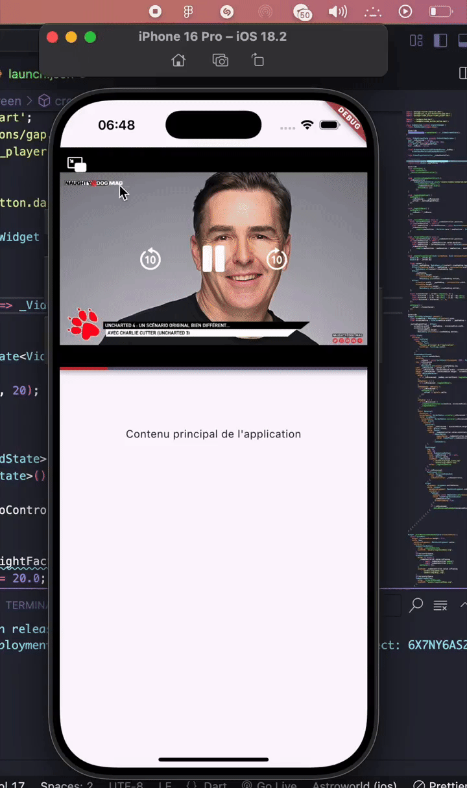

# 📺 Flutter Floating Video Player

Hi there 👋🏾

This project demonstrates how to build a **native floating video player** in Flutter. It enables users to **continue watching a video in a movable mini-window** while interacting with other parts of the application.

> 🎯 Fully built with Flutter — **no external packages** were used for the floating window behavior.

---

## 🎥 Demo 1

## 🎥 Demo 2

---

## 🚀 Features

- 📱 Draggable floating video player  
- 🔄 Smooth transition between fullscreen and mini mode  
- ❌ Dismiss mini-player easily   
- ⚙️ 100% native Flutter — no external floating window package

---

## 🧱 Tech Stack

- Flutter
- `Stack`, `Positioned`, `GestureDetector, ...` for custom floating behavior
- `video_player`

---

